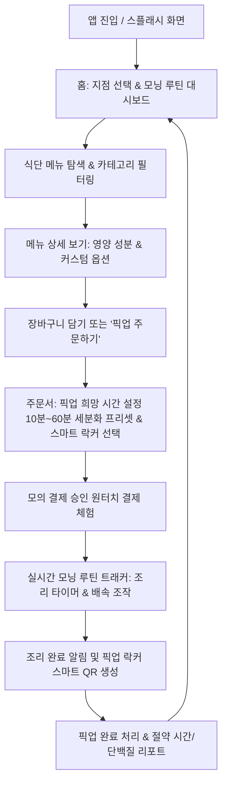

# [PRD] ROUTINE O 모바일 앱 서비스 인터랙티브 체험 웹페이지 (App Simulator)

---

## 1. 프로젝트 개요 (Project Overview)

### 1.1 서비스 명칭
- **ROUTINE O (루틴 오) - Interactive App Simulator**
- 슬로건: *"기다림을 내 시간으로 바꾸는 스마트 모닝 루틴 (F&B × FITNESS)"*

### 1.2 기획 배경 및 목적
- 본 프로젝트는 `index.html` 공식 랜딩페이지에서 소개하는 피트니스 연계 F&B 스마트 오더 서비스인 **ROUTINE O**의 핵심 가치와 사용자 경험(UX)을 사용자가 직접 웹 브라우저에서 생생하게 체험할 수 있도록 구현하는 **가상 모바일 앱 시뮬레이터 웹페이지**입니다.
- **핵심 페인 포인트 해결**: 아침 운동 후 샤워를 마친 뒤 식단을 주문하면 발생하는 15분 이상의 대기 시간으로 인해 아침 식사를 거르거나 지각하는 직장인의 문제를 해결합니다.
- **핵심 가치 체험**: **[운동 종료 → 샤워 전 식단 주문 및 샤워 시간 설정 → 샤워 중 실시간 맞춤 조리 → 샤워 직후 대기 0초 픽업]**에 이르는 전 과정을 모바일 뷰 인터페이스로 완벽하게 재현합니다.
- **기술적 제약 및 방향**: 별도의 백엔드 데이터베이스 서버 없이 **순수 바닐라 자바스크립트(Vanilla HTML5, CSS3, ES6+ JS)**와 브라우저 `localStorage`만을 사용하여 단독 실행 가능한 고성능·경량 웹 애플리케이션으로 제작합니다.

---

## 2. 타깃 고객 및 핵심 페르소나 (Target Audience & Personas)

| 페르소나 구분 | 주요 특성 | 니즈 및 페인 포인트 | 앱 체험 기대 효과 |
| :--- | :--- | :--- | :--- |
| **바쁜 아침 피트니스족** (주 타깃) | 2030 직장인, 출근 전 여의도·강남 등 도심 피트니스 센터 이용 | 출근 시간이 촉박하여 운동 후 식사 대기 시간을 감당하기 어려움 | 샤워 시간에 맞춘 정밀 픽업으로 "아침 시간 15분 절약" 체감 |
| **식단 관리·헬스 케어족** | 고단백·저당 식단과 운동 루틴을 철저히 챙기는 웰니스 사용자 | 운동 후 단백질 흡수 골든타임(45분 이내) 준수 필요 | 영양 성분(단백질 38g 등) 확인 및 맞춤형 건강 식단 선택 |
| **B2B 파트너 및 매장 점주** | 피트니스 센터 운영자, 사내 복지 담당자, 샐러드/F&B 가맹점주 | 실제 서비스 론칭 전 앱 인터페이스 완성도 및 고객 동선 확인 필요 | 데스크톱/모바일 어디서든 별도 설치 없이 즉시 시연 가능한 데모 확인 |

---

## 3. 핵심 아키텍처 및 기술 스펙 (Technical Specifications)

1. **프론트엔드 코어**:
   - 순수 HTML5 (Semantic Markup)
   - 순수 CSS3 (Modern Flexbox/Grid, CSS Custom Properties, Glassmorphism, Micro-animations)
   - 바닐라 자바스크립트 (ES6+, Class/Module 패턴 지향, 노 프레임워크, 노 빌드 도구)
2. **데이터 저장소 (No-Database)**:
   - 클라이언트 사이드 인메모리 상태 관리(State Store)
   - 브라우저 `localStorage`를 활용한 장바구니, 최근 주문 내역, 루틴 통계, 사용자 설정 영속화
3. **디자인 시스템 (Design Tokens)**:
   - `index.html`과 일관된 다크 모드 & 네온 에메랄드 테마
   - Background: `#0d131a` (Dark Base), `#141e2b` (Navy), `#1a2636` (Card Panel)
   - Brand Accent: `#10b981` (Emerald Green), `#22c55e` (Light Green), `#06b6d4` (Teal)
   - Typography: Google Fonts (`Noto Sans KR`, `Inter`)
   - Icons: FontAwesome 6.4 Free CDN
4. **반응형 폼팩터 (Responsive Form-Factor)**:
   - **데스크톱 환경**: 세련된 프리미엄 스마트폰 디바이스 목업(iPhone 프레임, 노치/다이내믹 아일랜드, 홈 바) 중앙 렌더링 + 좌우 서비스 소개/시뮬레이션 조작 패널 제공
   - **모바일 브라우저 환경**: 100vh 풀스크린 네이티브 앱 감성 인터페이스로 자동 전환

---

## 4. 유저 저니 및 화면 흐름도 (User Flow)



---

## 5. 기능 분류 및 상세 요구사항 (Feature Classification & Requirements)

### 5.1 핵심 기능(Core) vs 서브 기능(Sub) 한눈에 보기

| 분류 | 기능명 | 주요 역할 및 제공 가치 | 필수 여부 |
| :--- | :--- | :--- | :---: |
| **핵심 (Core 1)** | **메뉴 브라우징 (Menu Browsing)** | 카테고리별 식단 탐색, 고단백/저당 영양 성분(단백질g, 칼로리 등) 및 가격 확인 | **필수 (Core)** |
| **핵심 (Core 2)** | **식단 주문 & 결제 (Order & Pay)** | 메뉴 옵션(드레싱/토핑) 선택, 장바구니/원터치 모의 결제 주문 접수 | **필수 (Core)** |
| **핵심 (Core 3)** | **픽업시간 지정 (Pickup Time Scheduling)** | 헬스 중/샤워 전 상황에 맞춰 10~60분 세분화 픽업 시간 지정 및 도착 시각 자동 계산 | **필수 (Core)** |
| **핵심 (Core 4)** | **잔여시간 표시 (Remaining Time)** | 운동/샤워/조리 실시간 카운트다운 타이머(MM:SS) 및 원형 프로그레스 링 시각화 | **필수 (Core)** |
| **핵심 (Core 5)** | **픽업 알림 & 수령 (Pickup Alert)** | 조리 완료 푸시/상태 알림, 스마트 락커 번호 및 가상 QR 코드 픽업 티켓 발급 | **필수 (Core)** |
| 서브 (Sub 1) | **스플래시 & 온보딩** | 앱 시작 브랜드 인트로 애니메이션, 스마트폰 상태바(시간/배터리/와이파이) | 서브 (UX) |
| 서브 (Sub 2) | **시뮬레이터 조작 패널** | 10배속 빠른 감기, 조리 즉시 완료(Skip), 루틴 일시정지 등 체험 편의 도구 | 서브 (Demo) |
| 서브 (Sub 3) | **마이 루틴 & 히스토리** | `localStorage` 기반 누적 절약 시간, 누적 단백질 섭취량, 주문 내역 보관 | 서브 (Data) |
| 서브 (Sub 4) | **사운드 & 인터랙션 피드백** | 조리 완료 차임벨 효과음(Web Audio API), 버튼 햅틱 펄스 애니메이션 | 서브 (Aesthetic) |
| 서브 (Sub 5) | **데스크톱 랩(Lab) 환경** | 데스크톱 모니터용 좌/우측 상태 콘솔, Live JSON 뷰어, 스마트폰 외곽 프레임 | 서브 (Demo) |
| 서브 (Sub 6) | **앱 내 배너 시스템 (In-App Banners)** | 피트니스 제휴 배너, 프로모션 이벤트 배너, 고객 설문조사 연계 배너, 루틴 팁 띠배너 | 서브 (Marketing) |
| 서브 (Sub 7) | **제휴 헬스장 지도 & 락커 찾기 (Gym Map)** | `../data/부산_헬스장_202603.csv` 1,115개 실데이터 기반 내 주변 헬스장 지도 및 락커 위치 탐색 | 서브 (Location) |

---

### 5.2 [핵심 기능] 5대 서비스 루틴 플로우

#### [Core 1] 메뉴 브라우징 (Menu Browsing)
- **카테고리 탭 탐색**: `전체`, `고단백 보울/샐러드`, `단백질 쉐이크`, `저당 요거트/간식` 필터링 지원.
- **영양 정보 중심 카드**: 각 메뉴마다 단백질(g), 당류(g), 칼로리(kcal), 가격을 전면에 강조.
- **기본 제공 Mock 식단**:
  1. 수비드 닭가슴살 & 아보카도 보울 (8,900원 / 단백질 38g / 420kcal)
  2. 그릴드 비프 & 퀴노아 웜보울 (10,500원 / 단백질 42g / 510kcal)
  3. 노르웨이 생연어 & 바질 펜네 보울 (11,200원 / 단백질 34g / 460kcal)
  4. 웨이 프로틴 카카오 스무디 (5,500원 / 단백질 28g / 210kcal)
  5. 수제 저당 그릭요거트 & 그래놀라 (4,800원 / 단백질 18g / 280kcal)

#### [Core 2] 식단 주문 및 커스텀 (Order & Customization)
- **맞춤 옵션 선택**: 드레싱(저당 오리엔탈, 스리라차 마요, 발사믹), 추가 토핑(수란, 닭가슴살 추가 등).
- **주문 접수 및 모의 결제**:
  - `ROUTINE O 퀵페이 (원터치 간편결제)` 시뮬레이션.
  - 제휴 헬스장 회원 인증 시 10% 자동 할인 + 웰컴 쿠폰(-3,000원) 중복 적용 지원.
  - '픽업 예약 결제하기' 터치 시 0.8초 로딩 피드백 후 즉시 접수 완료.

#### [Core 3] 픽업시간 지정 (Pickup Time Scheduling)
- **개념 정의**: 단순 샤워 시간뿐만 아니라 **"운동 시작 시 미리 주문", "유산소/마무리 운동 중 주문", "샤워 직전 주문"** 등 다양한 피트니스 이용 패턴을 모두 수용하는 **유연한 픽업 시간 예약 시스템**.
- **10단계 세분화 프리셋 칩 (10 ~ 60분)**:
  - 🚿 **샤워 직전 빠른 픽업**: `10분`, `15분 (추천)`, `20분`
  - 🧴 **여유로운 샤워 & 환복**: `25분`, `30분`
  - 🏃‍♂️ **유산소/마무리 운동 중 미리 주문**: `40분`, `45분`
  - 🏋️‍♂️ **웨이트/헬스 시작 시 미리 주문**: `50분`, `55분`, `60분`
- **시간 직접 미세 조정 (+/- 5분 단위)**: 버튼 터치로 원하는 정확한 픽업 분 설정 지원.
- **실시간 픽업 예정 시각 자동 연동**:
  - 선택한 분에 따라 현재 시스템 시간과 합산하여 자동 계산 (예: *현재 07:30 + 45분 선택 시 ➜ "08:15 AM 픽업 예정"*).
  - 픽업 희망 시간에 맞춰 조리가 역산되어 가장 신선하고 따뜻한 상태로 보온 락커에 보관됨을 사용자에게 시각적으로 안내.

#### [Core 4] 잔여시간 표시 (Remaining Time & Routine Tracker)
- **실시간 카운트다운 타이머**: 남은 시간(MM:SS)이 1초 단위로 줄어드는 실시간 타이머 작동.
- **원형 프로그레스 링 (Circular Progress)**: 진행률(0% → 100%)을 SVG 원형 링 애니메이션으로 직관적 표시.
- **3단계 상태 인터랙션**:
  - 1단계: `주문 접수 완료 (예약 시간 연동 대기/준비)`
  - 2단계: `영양 토핑 신선 조리 중` (픽업 10분 전 집중 조리)
  - 3단계: `보온 픽업함 보관 완료` (남은 시간 00:00)

#### [Core 5] 픽업 알림 및 스마트 수령 (Pickup Notification & Locker)
- **도착 및 완료 알림**: 타이머 종료 시 상단 팝업 배너 또는 다이내믹 아일랜드 애니메이션 알림 발송.
- **스마트 픽업 티켓**:
  - 선택된 제휴 헬스장의 비대면 보온 락커 번호 제공 (예: `[센텀 프리미어짐] 보온 락커 B-04호`)
  - 픽업 인증용 가상 동적 QR 코드 및 4자리 핀 번호 (`#0724`) 표시.
- **수령 완료 액션**: '픽업 완료' 버튼 클릭 시 도어 오픈 애니메이션 후 성과 리포트(절약 시간: 15분, 섭취 단백질: 38g) 도출.

---

### 5.3 [서브 기능] 사용성 및 시뮬레이션 지원 기능

#### [Sub 1] 스플래시 온보딩 & 시스템 상태바
- 앱 실행 시 1초간 ROUTINE O 브랜드 로고 모션 표시 후 메인 자동 전환.
- 디바이스 최상단 상태바(실제 현재 시각, Wi-Fi, 배터리 아이콘) 구현.

#### [Sub 2] 시뮬레이터 조작 패널 (체험 전용 기능)
- 실제 15분을 기다리지 않아도 되도록 **[10배속 가속]**, **[즉시 조리 완료(Skip)]**, **[일시정지/재개]** 컨트롤러 제공.
- 시연 중 언제든 초기 상태로 되돌리는 **[체험 리셋(Reset)]** 기능.

#### [Sub 3] 마이 루틴 & 히스토리 (LocalStorage 기반)
- 브라우저 `localStorage`를 활용하여 최근 주문 내역 보관.
- 누적 절약 시간(예: `총 45분 절약`), 누적 섭취 단백질량 누적 통계 표시.

#### [Sub 4] 오디오 및 비주얼 피드백
- Web Audio API를 활용한 무음 차임벨/완료 비프음 (토글 온/오프 가능).
- 버튼 클릭 시 미세한 스케일 축소/확대 애니메이션 및 펄스 효과.

#### [Sub 5] 데스크톱 전용 3단 랩(Lab) 환경
- 데스크톱 화면에서 중앙 스마트폰 프레임 좌우로 '서비스 기획 배경'과 '실시간 State/JSON 디버그 뷰'를 동시 제공하여 프레젠테이션/포트폴리오 용도로 최적화.

#### [Sub 6] 앱 내 배너 시스템 (In-App Banners & Promotion)
- **홈 화면 상단 메인 롤링 배너 (Carousel Banner)**:
  1. **🏋️‍♂️ 피트니스 센터 제휴 혜택 배너 (핵심 연계)**:
     - 카피: *"제휴 피트니스 회원 전 메뉴 10% 상시 할인 & 보온 락커 우선 배정! [내 제휴 헬스장 찾기 >]"*
     - 액션: 클릭 시 **[제휴 헬스장 지도 모달(Sub 7)]** 즉시 오픈.
     - 비주얼: 네온 에메랄드 덤벨 아이콘 및 프리미엄 파트너십 뱃지.
  2. **🎉 프로모션 이벤트 배너**:
     - 카피: *"ROUTINE O 론칭 기념! 첫 주문 3,000원 웰컴 쿠폰팩 즉시 지급"*
     - 액션: 클릭 시 모의 쿠폰 자동 적용 및 주문서 화면 연결.
     - 비주얼: 선물 상자 일러스트 및 그라데이션 하이라이트.
  3. **📋 고객 설문조사 연계 배너**:
     - 카피: *"모닝 루틴 사전 설문 참여 시 아메리카노 100% 증정 ☕"*
     - 액션: 클릭 시 기존 구축된 사전 설문 포털(`../01/web1.html`)로 새 탭 연결.
     - 비주얼: 설문 클립보드 아이콘 및 오렌지/골드 강조 포인트.
  4. **🔥 5일 연속 모닝 루틴 챌린지 배너**:
     - 카피: *"월~금 5일 연속 아침 루틴 달성 시 고단백 프로틴 보울 1회 무료 증정!"*
     - 액션: 챌린지 스탬프 현황판 팝업 연결.
- **인앱 띠배너 (Inline Sticky / Notification Strip)**:
  - **골든타임 팁 띠배너**: *"💡 운동 후 45분은 단백질 흡수 골든타임! 샤워 전 미리 주문하고 0초 대기 픽업하세요."*
  - **실시간 매장 혼잡도 알림 띠배너**: *"● 현재 선택된 헬스장 락커 여유 8석 (주문 즉시 맞춤 조리 진행 중)"*

#### [Sub 7] 제휴 헬스장 지도 & 스마트 락커 탐색 (Gym Map & Locker Locator)
- **실데이터 연동 배경**:
  - `../data/부산_헬스장_202603.csv` 파일의 실제 헬스장 1,115개 데이터(해운대구 157곳, 부산진구 153곳, 남구, 수영구 등)를 정제하여 `gym_data.js`로 추출 및 연계.
- **지도 인터페이스 (Map UI)**:
  - 고성능 지도 렌더러(Leaflet.js 기반)에 **Google Maps 일반 지도(Roadmap)** 단일 소스 적용 (별도 API 키 불필요, 한국어 지명 및 역명 최적화).
  - 상단 구(District) 선택 필터: `⭐ 공식제휴 (1호점)`, `해운대구 (센텀)`, `수영구`, `부산진구 (서면)`, `부산 전체 (1,115곳)` 칩 버튼.
  - 헬스장 상호명/동 실시간 검색창 제공.
- **제휴 마크 및 제휴 혜택 정책 (Strict Partner Policy)**:
  - **가상 공식 제휴 1호점(루틴제로 센텀점)**:
    - 펄스 애니메이션이 적용된 초록색 전용 핀(`partnerIcon`) 및 `⭐ 공식 1호점` 뱃지 노출.
    - 제휴 혜택: `10% 상시할인`, `스마트 보온 락커 완비`.
    - 선택 시 앱 전역에 10% 회원 할인 및 온열 락커 배정 연동.
  - **기타 1,114개 일반 피트니스**:
    - 제휴 마크 및 제휴 혜택(할인, 락커) 표시 엄격 금지.
    - 일반 피트니스 마커(`normalIcon`)로 표시되며, 상세 카드에 `일반 피트니스`, `제휴 미체결 (정가 운영)`, `매장 카운터 직접 픽업`으로 명확히 구분.
    - 매장 선택 시 정가 주문으로 진행.

---

## 6. 데스크톱 뷰 시뮬레이터 랩(Lab) 패널 사양

데스크톱 대화면에서는 중앙의 모바일 폰 뷰 외에 좌/우측 보조 패널을 배치하여 체험성을 극대화합니다.

```
+-------------------------------------------------------------------------------+
|                             ROUTINE O Simulator Header                         |
+---------------------+-------------------------------+-------------------------+
| [좌측 패널]         | [중앙 모바일 뷰 목업]          | [우측 패널]             |
| 1. 서비스 가치 설명 | - Dynamic Island / Status Bar | 1. 시뮬레이터 컨트롤러   |
| 2. 시나리오 가이드  | - iPhone Frame 컨테이너        |    (시간 배속/즉시완료)  |
| 3. 핵심 루틴 로직   | - 앱 인터랙션 풀스크린 화면    | 2. LocalStorage 상태창  |
| 4. 원본 index.html  | - 하단 네이티브 탭바          | 3. 현재 주문 Live JSON  |
|    바로가기 링크    | - Home Indicator Bar          | 4. 가상 알림 푸시 테스트|
+---------------------+-------------------------------+-------------------------+
```

---

## 7. 비기능적 요구사항 (Non-Functional Requirements)

1. **단독 구동성 (Portability)**:
   - 외부 웹 서버, Node.js 서버, 데이터베이스 없이 브라우저에서 `index_app.html`(가칭) 파일 더블클릭만으로 즉시 구동되어야 함.
2. **반응형 호환성**:
   - iOS Safari, Android Chrome, Desktop Chrome/Edge/Firefox 지원.
   - 모바일 접속 시 목업 프레임이 자연스럽게 해제되고 전체화면 웹앱(PWA 감성)으로 렌더링.
3. **접근성 및 인터랙션 피드백**:
   - 모든 버튼 터치 시 햅틱/스케일 피드백 (Active Scale: 0.96)
   - 스켈레톤 로딩 및 부드러운 화면 전환 트랜지션 (Duration: 250ms ~ 350ms)
4. **코드 가독성 및 유지보수성**:
   - 상태(State)와 뷰(DOM Rendering)의 명확한 분리
   - 메뉴 데이터와 설정 상수를 분리하여 데이터 추가/수정이 용이한 구조

---

## 8. 산출물 파일 구조 제안

```text
app/
├── PRD.md                     <-- (현재 생성된 제품 요구사항 정의서)
├── index.html                 <-- 기존 메인 브랜드 랜딩페이지
├── gym_data.js                <-- 신규: ../data/부산_헬스장_202603.csv 기반 1,115개 헬스장 좌표/주소 데이터
├── app_experience.html        <-- 신규: ROUTINE O 어플 서비스 체험 인터랙티브 웹페이지
├── app_experience.css         <-- 신규: 모바일 프레임 및 앱 컴포넌트 전용 스타일시트
├── app_experience.js          <-- 신규: 바닐라 JS 상태 관리, 라우팅, 타이머, 지도, 오더 로직
├── poster1.png ~ poster6.png  <-- 기존 이미지 에셋 활용
├── card1.png ~ card6.png      <-- 기존 이미지 에셋 활용
└── image/                     <-- 기존 메뉴 및 프로모션 에셋
```

---

## 9. 검증 기준 (Acceptance Criteria)

- [ ] 별도의 설치 및 DB 없이 브라우저에서 모든 플로우가 에러 없이 작동하는가?
- [ ] 모바일 프레임 내부에서 메뉴 선택 → 옵션 지정 → 샤워 시간(10/15/20분) 설정이 정상 동작하는가?
- [ ] 주문 완료 후 실시간 타이머가 작동하며, 배속 조작 및 조리 완료 단계로 문제없이 전이되는가?
- [ ] 조리 완료 후 락커 QR 코드 및 루틴 리포트(절약 시간, 단백질량)가 정확히 산출되는가?
- [ ] 주문 내역이 `localStorage`에 저장되어 재방문 시에도 확인 가능한가?
- [ ] 데스크톱과 모바일 화면 모두에서 어색함 없이 몰입감 있는 디자인을 제공하는가?
